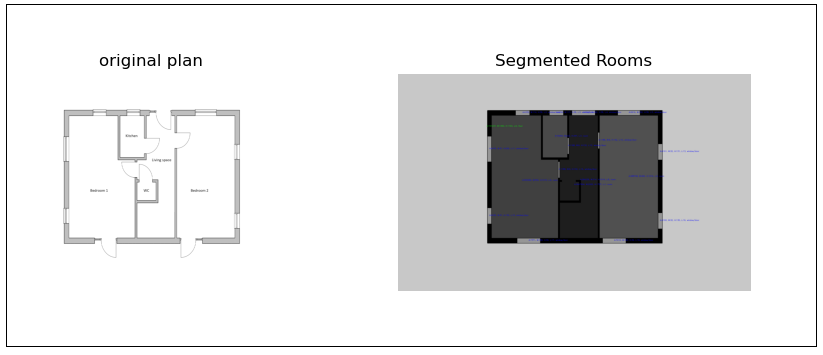

# Room Detection in Architectural Plans 🏠

This is a **simple and fun project** I created in my free time to detect rooms in architectural plan drawings using pure **OpenCV**. I thought it might be useful to share it in case others find it interesting or helpful.





---

## Requirements
- Python 3.x
- OpenCV
- NumPy
- Matplotlib

Install dependencies using:
```bash
pip install opencv-python matplotlib numpy
```


## Code Explanation
- **Input:** Grayscale floor plan image.
- **Output:** Segmented image highlighting rooms, walls, and other components.


#### The main steps include:

- **Binary Mask Creation:** Thresholding the input to isolate structures.
- **Edge Detection:** Using the Canny edge detector to identify lines.
- **Line Merging:** Hough Transform combines lines for room segmentation.
- **Connected Components Analysis:** Detects and labels rooms, doors, and spaces.


## Usage:

Place your architectural plan image in the data folder (e.g., floor_plan.png). Run the script:
```bash
python detect_rooms.py
```
Results will be displayed comparing the original and segmented images.


## Notes
- This project is not perfect and was created for learning purposes.
- Feel free to modify, share, or contribute if you're interested!